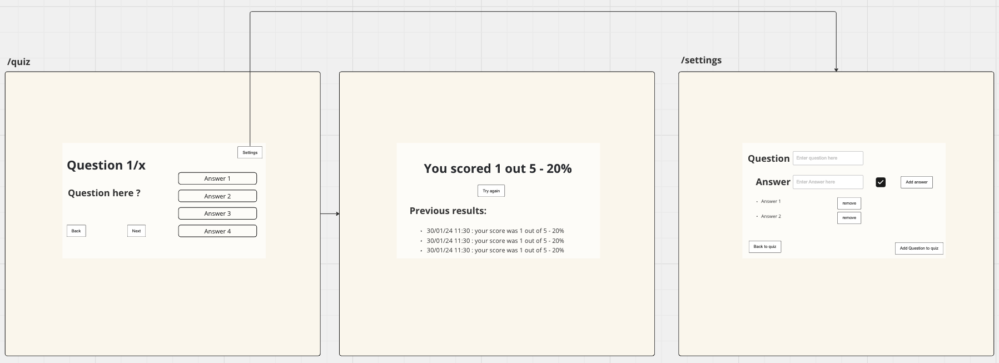

# Welcome to Centrica FE technical assessment

## Setup

- Clone the repo `git clone git@github.com:ConnectedHomes/Quiz.git`
- Run `npm install`
- Run `npm run dev`

## What we are looking for

We'll be judging you on the following:

- Clear, concise, readable JavaScript or TypeScript - use whatever you're most comfortable with.
- A functional approach to solving problems.
- Attention to detail, matching the provided designs.
- Semantic, accessible HTML.
- Well written types for functions, variables and data structures (if you're using TS).

We won't be judging you on:

- CSS skills - we will focus on substance over style. A basic understanding of CSS is fine.

## Context

Today we will be building a quiz app. The quiz app will be a single page application that will allow users to answer questions and see their score at the end as well as add questions to it.

## Requirements

This is a sktech of the quiz app. You can use this as a reference for the requirements.



## Before you begin

Firstly, **create a branch for your work** - you will be submitting via a Pull Request so it's important you work in a separate branch. It doesn't matter what you call it.

## Task 1 - Create the quiz layout with hardcoded data

For this task, create the quiz layout with hardcoded data. You can use the following:

```js
 {
  questions: [
    {
      id: 'abc123457u',
      question: 'What is the capital of France?',
      answers: [
        { text: 'London', isCorrect: false },
        { text: 'Paris', isCorrect: true },
        { text: 'New York', isCorrect: false },
        { text: 'Dublin', isCorrect: false },
      ],
    },
  ],
};
```

## Task 2 - Create the quiz layout with real data

here, we will continue what we started on task 1 but this time we will use data from an endpoint. You can use the following endpoint to get the data:

first start the server by running `npm run json-server` then you can use the following endpoint to get the data: `http://localhost:3001/questions`

Talking points:

- How would you handle errors?
- How would you handle loading state?

## Task 3 - Add the ability to answer questions and navigate through them

We will add the ability to answer questions and navigate through them. The user should be able to select an answer and then click on the next button to go to the next question. The user should not be able to go to the next question if they have not selected an answer. The user should be able to go back to the previous question and change their answer. The user should be able to see the number of questions they have answered and the total number of questions.

## Task 4 - Add the ability to see the score

We will add the ability to see the score. The user should be able to see the score at the end of the quiz. The score should be calculated based on the number of correct answers. The user should be able to see the number of questions they have answered and the total number of questions as well as the percentage.

## Task 5 - Add the ability to see previous results

We will add the ability to see previous results. The user should be able to see the previous results. The user should be able to see the number of questions they have answered, the total number of questions as well as the percentage and the date/time.

## Task 6 - Add the ability to add questions

We will add the ability to add questions. The user should be able to add a question and answers. The user should not be able to add a question if they have not filled in all the fields. The user should be able to see the questions they have added. This form will live in a new page `/settings`

## Task 7 - Remove the ability to go back to the previous question

We will remove the ability to go back to the previous question. The user should not be able to go back to the previous question.

## Task 8 - Add the time limit to answer questions

We will add the time limit to answer questions. The user should be able to see the countdown for each question. The user should not be able to answer the question if the time limit has passed, it should be marked as incorrect and automatically go to the next question.

## Submitting your work

When you're ready to submit you should create a Pull Request to merge your
branch into main.
Once you've made the Pull Request, feel free go through the diff and add any inline comments to explain your thinking and approach to solutions and potential improvements.

Once that's done, send a link to the pull request to your interviewer so we know your work is ready to be reviewed.
